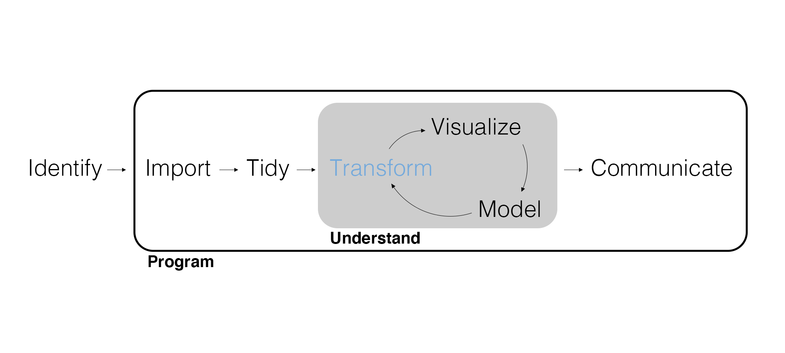
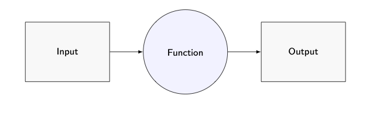
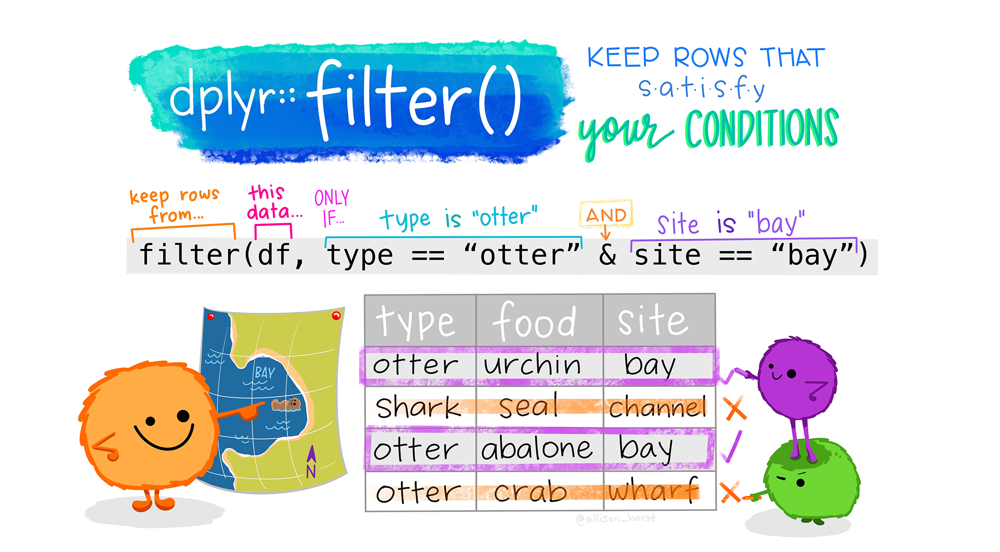
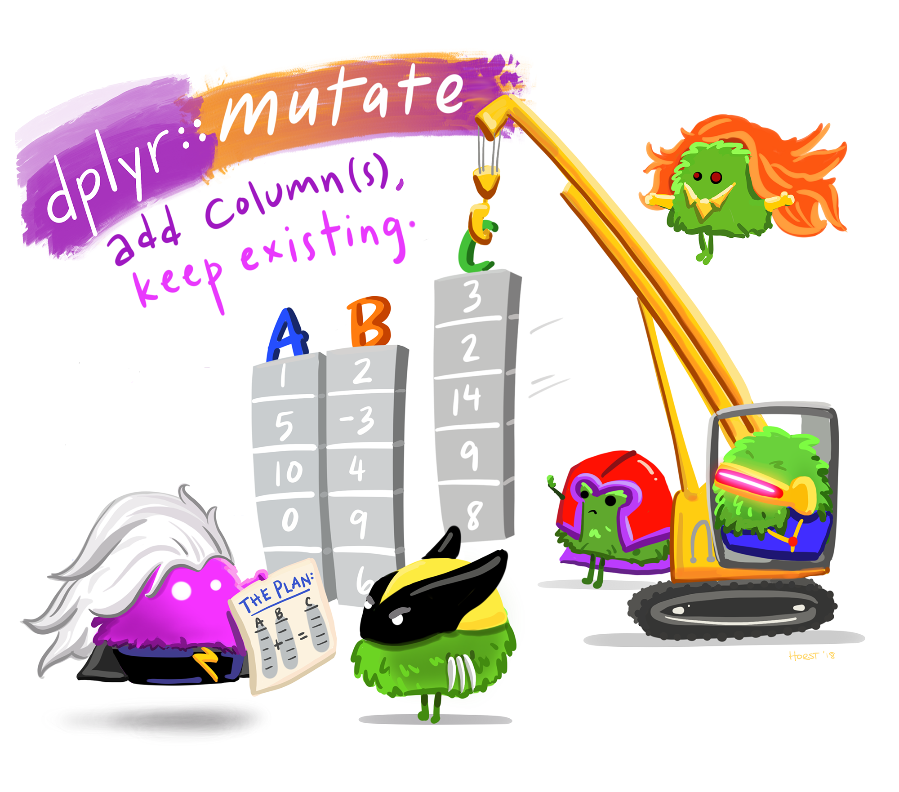
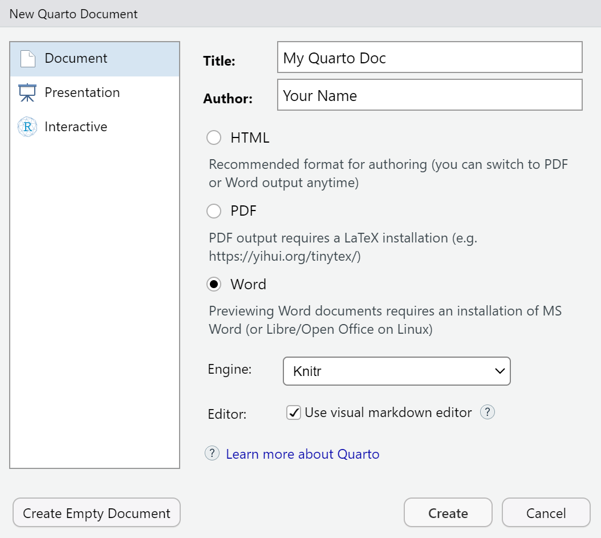

## Marketing Analytics Process

<center>
{width=900px}
---

## Motivating Example

Imagine you're working as an analyst for a large retail company like Patagonia and your manager gives you a messy spreadsheet exported from the CRM (Customer Relationship Management) system. The data includes names, locations, and demographic details for thousands of customers. She also sends you a huge file containing the transaction history for all the customers, but the only thing the two files have in common is the customer IDs. She asks you to find the 100 longest-standing customers, and figure out which 5 states brought in the most revenue last year. How would you do this? 

##  Let's Get Set Up With R/RStudio

<center>
{width=900px}
</center>

## A Word About Downloading and Organizing Files

One of the most important skills you should strive to develop is the ability to
organize and manage files. Right now, create a MKTG-411 folder on your computer.
Every file you download for this class should live in this folder. You should
never be working out of your Downloads folder. Now, go download the folder for
Lecture 1 from Canvas, and move it to your designated MKTG-411 folder.

## R/RStudio Orientation

- Console: Where you run code and perform calculations.

```{r}
#| eval: false
5 + 5
```

- Source: Create and **save** R scripts and send code to the Console. We will 
also use lots of Quarto documents in this class, which allow you to write and 
run code in chunks from the source window

```{r}
#| eval: false
# Use comments to explain the why of your code.
print(2 * (18 - 7))
```

- Environment: A snapshot of the data, variables, and functions you've loaded.
- Help: Look up documentation including cheatsheets.
- Files: The **working directory** for your project.

## RStudio Tools > Global Options

- General > Save workspace to .RData on exit: Never.
- Code > Editing > Execution > Ctrl + Enter executes: Multiple consecutive R lines.
- Code > Editing > Use native pipe operator.
- Code > Display > General > Highlight selected line.
- Code > Display > General > Rainbow parentheses.
- Code > Saving > Automatically save when editor loses focus.
- Appearance.

## Functions

<center>
{width=650px}
</center>

We import, wrangle, visualize, and model data using **functions**. Functions are composed of **arguments** that tell the function how to operate.

- Using a function is referred to as a “call” or a “function call.”
- Don’t forget you have Help.

## The tidyverse

The **tidyverse** is a collection of R packages that share common philosophies and are designed to work together. An **R package** is a collection of functions, documentation, and sometimes data.

```{r}
library(tidyverse)
```

## Import CSV Files

```{r}
customer_data <- read_csv("customer_data.csv", show_col_types = FALSE)
```

---

- Note that `customer_data` now appears in our Environment.
- The Environment lists any **objects** (i.e., data or custom functions) we've assigned a name using `<-`.
- We can also view objects in their own tab.

## Data Frames

```{r}
customer_data
```

---

```{r}
glimpse(customer_data)
```

## Transform Data

The heart of data wrangling is **transforming data**.

- Filter observations.
- Arrange observations.
- Slice observations.
- Select variables.
- Mutate variables (i.e., recode or create new variables).
- Join data frames.

{dplyr} provides a consistent **grammar for transforming data** with functions (a.k.a., **verbs**) that mirror SQL.

---

<center>
{width=900px}
</center>

## Filter Observations

We often want to filter our data to **keep certain observations based on their values for a certain column**.

```{r}
filter(customer_data, college_degree == "Yes")
```

---

```{r}
filter(customer_data, region != "West")
```

---

How would we filter by `gender == "Female"` and `income > 70000`?

Why are we putting quotes around `"Female"` but not `gender`?

---

```{r}
filter(customer_data, gender == "Female", income > 70000)
```

## Your Turn!

Write code that filters to only display married customers born before 1995.

## Solution

```{r}

filter(customer_data, married == "Yes", birth_year < 1995)

```


## Slice Observations

Sometimes we want to slice our data to **keep certain observations based on their position in the data**.

```{r}
slice(customer_data, 1:5)
```

## Arrange Observations

We can arrange observations to reveal helpful information and check data.

```{r}
arrange(customer_data, birth_year)
```

---

```{r}
arrange(customer_data, desc(birth_year))
```

## Select Variables

Sometimes we only care to **keep certain variables**, especially when working with a large dataset.

```{r}
select(customer_data, region:review_text)
```

---

<center>
{width=600px}
</center>

## Mutate Variables

We can also **recode existing variables** or **create new variables**.

```{r}
mutate(customer_data, income = income / 1000)
```

---

Two important things to remember:

1. We can **overwrite** variables in a data frame as well as objects if we use the same name.
2. Good variable and object names only use lowercase letters, numbers, and `_`. Most importantly, they should be descriptive and easy to identify. A poor variable name might be something like "Variable2" or "x", whereas a good variable might be 'transaction_history' or 'cleaned_crm_data'.

## Join Data Frames

A common variable (e.g., a customer ID) allows us to **join** two data frames.

```{r}
store_transactions <- read_csv("store_transactions.csv", show_col_types = FALSE)
```

---

```{r}
glimpse(store_transactions)
```

---

A **left join** keeps all rows in the "left" or first data frame that you list, and all columns from both data frames. A left join is a good "default" join to start with.

```{r}
left_join(customer_data, store_transactions, join_by(customer_id))
```

---

<center>
{width=500px}
</center>

---

An **inner join** keeps rows that have matching IDs along with all columns from both data frames.

```{r}
inner_join(customer_data, store_transactions, join_by(customer_id))
```

---

<center>
{width=500px}
</center>

## Consecutive Function Calls

We typically want to perform many consecutive function calls. You might be tempted to do the following. **Don't do this!**

```{r}
crm_data_2 <- left_join(customer_data, store_transactions, join_by(customer_id))
crm_data_3 <- filter(crm_data_2, region == "West", feb_2005 == max(feb_2005))
crm_data_4 <- mutate(crm_data_3, age = 2022 - birth_year)
crm_data_5 <- select(crm_data_4, age, feb_2005)
crm_data_6 <- arrange(crm_data_5, desc(age))
crm_data_7 <- slice(crm_data_6, 1)

crm_data_7
```


---

This would be another way run the same code. **Don't do this either!**

```{r}
slice(
  arrange(
    select(
      mutate(
        filter(
          left_join(
            customer_data, store_transactions, join_by(customer_id)), 
          region == "West", feb_2005 == max(feb_2005)
        ), 
      age = 2022 - birth_year), 
    age, feb_2005), 
  desc(age)), 
1)
```

## Consecutive Lines of Code

Part of the common philosophy for the tidyverse is that:

- Each function should do one specific thing well.
- Each function should have a data frame as an input and a data frame as an output.

This allows us to `|>` together functions in **consecutive lines of code** so that it is easier for humans to read and less error-prone.

---

```{r}
filter(customer_data, credit == 850, state == "WY")
```

```{r}
customer_data |> 
  filter( credit == 850, state == "WY")
```

---

- So what does the `|>`, often known as the 'pipe operator' do?
- What's the deal with the indented line after the `|>`?
- Let's rewrite our terrible code using the `|>`.
- The shortcut to type the pipe operator is ctrl + shift + m (or command for mac)

---

Read `|>` as *"then"*. (If we need to use `<-`, we typically put it at the beginning.)

```{r}

customer_data |> 
  left_join(store_transactions, join_by(customer_id)) |> 
  filter(region == "West", feb_2005 == max(feb_2005)) |> 
  mutate(age = 2026 - birth_year) |> 
  select(age, feb_2005) |> 
  arrange(desc(age)) |> 
  slice(1)
```

## Your Turn!

Try writing comments that explain what each line of this code is doing.

```{r, eval= FALSE}

customer_data |> 
  left_join(store_transactions, join_by(customer_id)) |> 
  filter(region == "West", feb_2005 == max(feb_2005)) |> 
  mutate(age = 2026 - birth_year) |> 
  select(age, feb_2005) |> 
  arrange(desc(age)) |> 
  slice(1)
```

## Instructions for Setting Up Your Own Quarto Docs

In the future, all homework for this class will be submitted as Quarto documents that have been rendered into Word files. This is the same kind of file your starter code was in today.

---

To create one, click File > New File > Quarto Document. This box should pop up:

<center>
{width=500px}
<center>

Just add the document title, your name, and select Word!

## Wrapping Up

*Summary*

- Covered the basics of coding in R.
- Practiced some essential functions for transforming data with {dplyr}.

*Next Time*

- Summarizing discrete data with {dplyr}.
- Visualizing discrete data with {ggplot2}.

*Supplementary Material*

- *R for Data Science (2e)* Chapters 3, 4, and 5

*Artwork by @allison_horst*

## Exercise 2

In RStudio, create a new Quarto document, load the tidyverse, and import the data. Don't forget to ensure that a copy of your data files is in your working directory! Then, using the `|>` in consecutive lines of code, find the customers who have spent the most recently by doing the following.

1. Join the `customer_data` and `store_transactions` data.
2. Only keep customers in the `South`.
3. Create a new variable `age` using `2026 - birth_year`.
4. Only keep the variables `age`, `gender`, `income`, `credit`, `married`, `college_degree`, `region`, and `dec_2018`.
5. Arrange the data in descending order based on `dec_2018` transactions.
6. Keep the top 3 rows of data.
7. Who appears to be purchasing the most items for that month in the South?
8. Render the Quarto document as a Word Doc and upload to Canvas.

